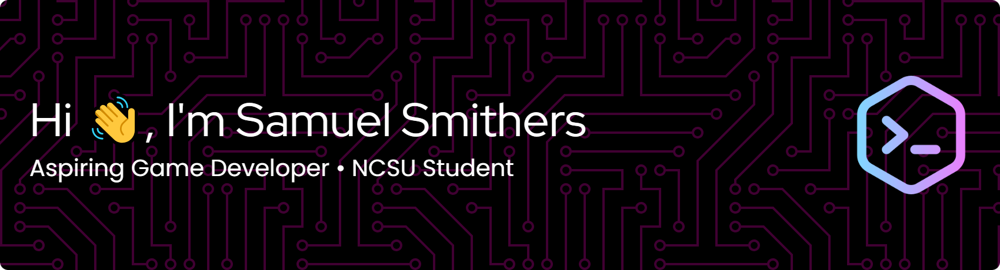

    
    

## 
 About Me 

Hello! I'm a Computer Science student in the Class of 2029 at North Carolina State University. I like expressing my creative side as much as possible, and enjoy learning how various systems work from the ground up. I typically work with Python, Java, C#, or Brigadier, Minecraft's command language. 

- I primarily think about problems from a theory perspective, and working backwards from there.
- I always ask myself, "How was that done?"

##  Projects 

<table align="center">
    <tr>
        <td align="center">
            <h3><u>FlaskNAS</u></h3>
            

                The
            

        </td>
        <td>2</td>
    </tr>
    <tr align="center">
        <td align="center">3</td>
        <td align="center">4</td>
    </tr>
</table>

<!--
**Tebsickle/Tebsickle** is a ✨ _special_ ✨ repository because its `README.md` (this file) appears on your GitHub profile.

Here are some ideas to get you started:

- 🔭 I’m currently working on ...
- 🌱 I’m currently learning ...
- 👯 I’m looking to collaborate on ...
- 🤔 I’m looking for help with ...
- 💬 Ask me about ...
- 📫 How to reach me: ...
- 😄 Pronouns: ...
- ⚡ Fun fact: ...
-->
